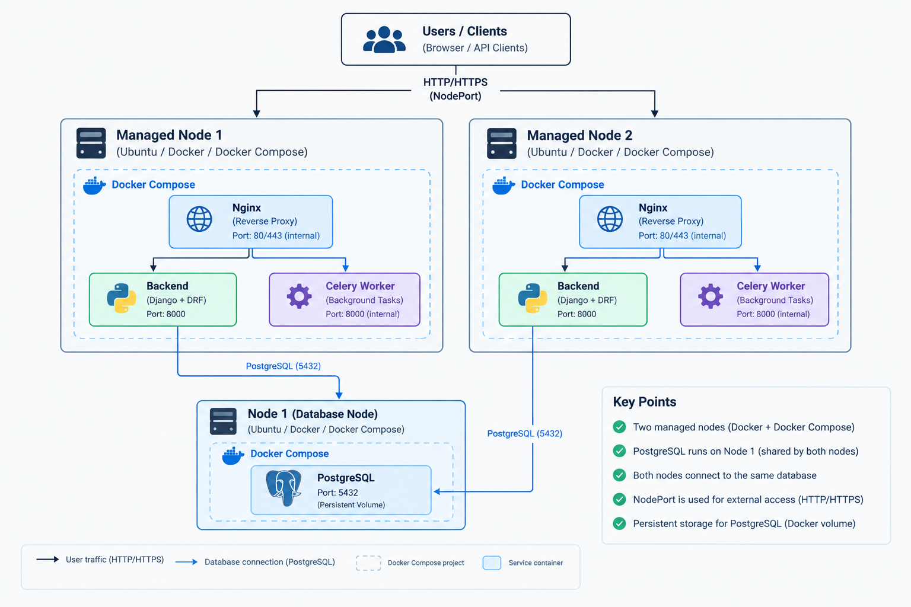

# Divar Platform

یک پروژه‌ی بک‌اند مشابه پلتفرم‌های آگهی آنلاین، با تمرکز بر **Backend Development، Containerization و Infrastructure Automation**.

این پروژه علاوه بر توسعه‌ی سرویس بک‌اند، برای تمرین و پیاده‌سازی مفاهیم DevOps مانند **Docker، Docker Compose، PostgreSQL و Ansible** طراحی شده است.

---

## 🏗 معماری پروژه

ساختار فعلی محیط اجرا شامل یک Host اصلی و دو Node مدیریت‌شده توسط Ansible است:

# Divar Platform

## Architecture


<p align="center">
  
</p>


### Nodeها

| Node  | IP           | نقش                       |
| ----- | ------------ | ------------------------- |
| node1 | `172.24.0.2` | Database / Infrastructure |
| node2 | `172.24.0.3` | Application / Compute     |

مدیریت Nodeها از طریق **Ansible** انجام می‌شود.

---

## 🚀 تکنولوژی‌ها

### Backend

* Python
* Django / Django REST Framework
* PostgreSQL

### Containerization

* Docker
* Docker Compose

### Infrastructure / DevOps

* Ansible
* Linux
* Multi-node Docker environment

### CI

* GitHub Actions

---

## 📦 Docker Compose

سرویس‌های پروژه با Docker Compose مدیریت می‌شوند.

نمونه‌ی سرویس PostgreSQL:

```yaml
services:
  db:
    image: postgres:15
    container_name: divar_db
    restart: unless-stopped

    env_file:
      - .env

    volumes:
      - postgres_data:/var/lib/postgresql/data

    ports:
      - "5433:5432"

volumes:
  postgres_data:
```

### چرا PostgreSQL داخل Container؟

استفاده از Docker باعث می‌شود محیط اجرای دیتابیس قابل تکرار و مستقل از سیستم‌عامل Host باشد.

همچنین با استفاده از Volume، اطلاعات PostgreSQL با حذف یا recreate شدن Container از بین نمی‌رود.

---

## 🔐 Environment Variables

تنظیمات PostgreSQL در فایل `.env` قرار می‌گیرند:

```env
POSTGRES_DB=divar_db
POSTGRES_USER=admin
POSTGRES_PASSWORD=your_password
PORT=5432
```

فایل `.env` نباید در Repository عمومی قرار بگیرد.

برای پروژه‌ی واقعی بهتر است Secretها از طریق Secret Management یا سیستم‌های مدیریت Credential نگهداری شوند.

---

## ⚙️ Ansible

برای مدیریت Nodeها از Ansible استفاده شده است.

Inventory فعلی:

```yaml
all:
  children:
    servers:
      hosts:
        node1:
          ansible_host: 172.24.0.2
        node2:
          ansible_host: 172.24.0.3

      vars:
        ansible_user: ansible
        ansible_password: admin
        ansible_become_password: admin
        ansible_ssh_common_args: "-o StrictHostKeyChecking=no"
```

با این ساختار می‌توان عملیات را روی چند Node به‌صورت متمرکز اجرا کرد.

برای مثال:

```bash
ansible servers -m ping
```

یا:

```bash
ansible servers -b -m command -a "docker --version"
```

---

## 🐳 مدیریت Docker با Ansible

یکی از اهداف پروژه این است که عملیات مربوط به Docker و سرویس‌های پروژه از طریق Ansible قابل مدیریت باشد.

برای مثال اجرای Docker Compose روی `node1`:

```bash
ansible node1 -b -m command \
  -a "docker compose -f /opt/divar/docker-compose.yml up -d"
```

بررسی Containerها:

```bash
ansible node1 -b -m command -a "docker ps"
```

---

## 🗄 PostgreSQL

PostgreSQL به‌صورت Container روی `node1` اجرا می‌شود.

وضعیت Container:

```text
divar_db
```

Port Mapping فعلی:

```text
node1:5433 → PostgreSQL:5432
```

بررسی آماده بودن PostgreSQL:

```bash
docker exec divar_db \
  pg_isready -U admin -d divar_db
```

خروجی موفق:

```text
/var/run/postgresql:5432 - accepting connections
```

---

## 🔄 CI

پروژه برای اجرای بررسی‌های خودکار کد می‌تواند از **GitHub Actions** استفاده کند.

هدف CI:

* اجرای خودکار بررسی‌ها هنگام Push
* اجرای بررسی‌ها هنگام Pull Request
* جلوگیری از ورود تغییرات خراب به Branch اصلی
* ایجاد یک فرآیند قابل تکرار برای Validation

نمونه‌ی ساختار:

```text
Developer
    │
    ▼
Git Push / Pull Request
    │
    ▼
GitHub Actions
    │
    ├── Install Dependencies
    ├── Run Checks
    ├── Run Tests
    └── Build / Validation
```

> اگر Workflow مربوط به GitHub Actions هنوز در Repository قرار نگرفته، این بخش را بعد از اضافه کردن فایل Workflow فعال کن.

---

## 📁 ساختار پروژه

ساختار کلی پروژه به شکل زیر است:

```text
divar/
├── ansible.cfg
├── inventory.yml
├── playbook
├── Dockerfile
├── docker-compose.yml
├── .env
├── .gitignore
└── application/
    ├── manage.py
    ├── requirements.txt
    └── ...
```

ساختار دقیق دایرکتوری‌های Backend ممکن است با توجه به توسعه‌ی پروژه تغییر کند.

---

## 🛠 اجرای پروژه

### 1. Clone کردن Repository

```bash
git clone <repository-url>
cd divar
```

### 2. ایجاد Environment Variables

فایل `.env` را ایجاد کنید:

```env
POSTGRES_DB=divar_db
POSTGRES_USER=admin
POSTGRES_PASSWORD=your_password
PORT=5432
```

### 3. اجرای PostgreSQL

```bash
docker compose up -d
```

### 4. بررسی وضعیت Containerها

```bash
docker ps
```

### 5. بررسی PostgreSQL

```bash
docker exec divar_db \
  pg_isready -U admin -d divar_db
```

---

## 🤖 اجرای Infrastructure با Ansible

ابتدا ارتباط Nodeها را بررسی کنید:

```bash
ansible servers -m ping
```

بررسی Docker:

```bash
ansible servers -m command -a "docker --version"
```

ساخت دایرکتوری پروژه:

```bash
ansible servers -b -m file \
  -a "path=/opt/divar state=directory owner=ansible group=ansible mode=0755"
```

سپس فایل‌های پروژه را روی Node موردنظر قرار داده و سرویس‌ها را اجرا کنید.

---

## 🔍 اهداف DevOps پروژه

این پروژه فقط یک تمرین Backend نیست و بخشی از آن برای تمرین مفاهیم زیر توسعه داده شده است:

* Infrastructure Automation
* Configuration Management
* Containerization
* Docker Compose
* Multi-node Environment
* Database Containerization
* Persistent Storage
* Environment-based Configuration
* CI Automation
* Linux Server Administration

---

## 📌 وضعیت فعلی

### انجام شده

* [x] Backend application
* [x] PostgreSQL
* [x] Docker
* [x] Docker Compose
* [x] Persistent PostgreSQL Volume
* [x] Environment-based configuration
* [x] Multi-node Ansible inventory
* [x] Remote Docker management with Ansible
* [x] PostgreSQL deployment on `node1`

### در حال توسعه

* [ ] کامل کردن Deployment اتوماتیک Application با Ansible
* [ ] اتصال کامل Application به PostgreSQL روی Node جداگانه
* [ ] تکمیل CI Pipeline
* [ ] Automated Testing
* [ ] Production-oriented deployment

---

## 🎯 هدف پروژه

هدف اصلی پروژه، ترکیب مهارت‌های **Backend Development** با مفاهیم **DevOps و Infrastructure Automation** است.

تمرکز اصلی روی این است که Application از یک پروژه‌ی صرفاً محلی به محیطی قابل مدیریت، قابل تکرار و قابل استقرار تبدیل شود.

---

## 👨‍💻 Author

**Amirhosein Heydari**

Backend / DevOps Developer

GitHub: `amir-hash19`


# Divar Platform

## Architecture

